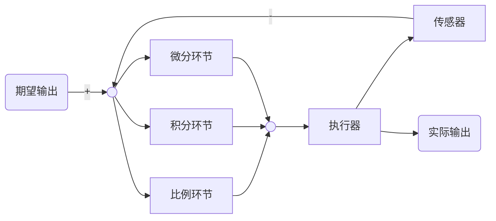

# **PID控制算法的C语言实现**

## **一、PID算法原理**

PID算法的一般形式：



PID的流程简单到了不能再简单的程度，通过误差信号控制被控量，而控制器本身就是比例、积分、微分三个环节的加和。这里我们规定（在t时刻）：

1. 输入量为$rin(t)$，也即设定的期望值；

2. 输出量为$rout(t)$，也即实际输出值；

3. 偏差量为$e_t=rin(t)-rout(t)$；


PID按照调节规律分为比例调节、比例积分调节和比例积分微分调节等。下面阐述它们各自的调节作用：

1. 比例调节控制规律为：

​		$y = K_p \cdot e_t + y_0$

​		$K_p$——比例系数，$y_0$——偏差，$e_t$——零时调节器的输出值 。当输出值与设定的期望值产生偏差时，比例调节器会自动调节控制变量$y$的大小。控制变量$y$的大小会朝着减小偏差$e$的方向变化。比例系数$K_p$的大小决定了比例调节器调节的快慢程度，$K_p$大调节器调节的速度快，但$K_p$过大会使控制系统出现超调或振荡现象。$K_p$小调节器调节的速度慢，但$K_p$过小又起不到调节作用。当负载变化时 ,除非重新调整相应的$y_0$值的大小，否则控制系统将会产生无法消除的静差值。如果偏差为0，则比例环节不起作用，只有存在偏差时，比例环节才起作用。

2. 比例积分调节控制规律为：

​		$y = K_p(e_t + \frac {1}{T_i} \cdot \int_0^t e_t dt)+y_0$

​		$T_i$为积分常数，它的物理意义是当调节器积分调节作用与比例调节作用的输出相等时所需的调节时间称为积分常数。积分常数$T_i$的大小决定了积分作用强弱程度，$T_i$选择的越小，积分的调节作用越强，但系统振荡的衰减速度越慢。当$T_i$过小时，甚至会造成系统的持续振荡，使调节器的输出波动不定。相反地当$T_i$选择的越大，积分的调节作用越弱，虽然过渡过程中不容易出现振荡现象，但消除偏差$e$的时间却很长。积分环节主要是用来消除静差，所谓静差，就是系统稳定后输出值和设定值之间的差值，积分环节实际上就是偏差累计的过程，把累计的误差加到原有系统上以抵消系统造成的静差。

3. 比例微分积分的控制规律为：

​		$y = K_p(e_t + \frac {1}{T_i} \cdot \int_0^t e_t dt + \frac{T_d de_t} {dt})+y_0$

$T_d$为微分常数 , 它的物理意义是当调节器微分调节作用与比例调节作用的输出相等时所需的调节时间称为微分常数。由于积分调节器输出值的大小是与偏差值的持续时间成正比的，这样会使系统消除静差的调节过程变慢，使系统的动态性能变差。当系统受到冲激式偏差冲击时，由于偏差的变化率很大，而PI调节器的调节速度又很慢，这样势必会造成系统的振荡而微分信号则反应了偏差信号的变化规律，或者说是变化趋势，根据偏差信号的变化趋势来进行超前调节，从而增加了系统的快速性。加入微分调节后，当偏差 e 瞬间波动过快时，微分调节器会立即产生激式响应，来抑制偏差的变化。而且偏差变化越快，微分调节的作用越大。从而使系统更趋于稳定，避免振荡现象的发生，改善了系统的动态性能。

理解一下这个公式，主要从下面几个问题着手，为了便于理解，把控制环境具体一下：

1. 规定这个流程是用来为直流电机调速的;

2. 输入量$rin(t)$为电机转速预定值;

3. 输出量$rout(t)$为电机转速实际值;

4. 执行器为直流电机;

5. 传感器为光电码盘，假设码盘为10线;

6. 直流电机采用PWM调速，转速用单位（转/min）表示;

不难看出以下结论：

1. 输入量$rin(t)$为电机转速预定值（转/min）;

2. 输出量$rout(t)$为电机转速实际值（转/min）;

3. 偏差量为预定值和实际值之差（转/min）;

那么以下几个问题需要弄清楚：

1. 通过PID环节之后的$y$是什么值呢？

2. 控制执行器（直流电机）转动转速应该为电压值（也就是PWM占空比）。

3. 那么$y$与PWM之间存在怎样的联系呢？

下一篇说明连续系统的离散化问题。并根据离散化后的特点讲述位置型PID和增量型PID的用法和C语言实现过程

## **二、PID算法的离散化**

下面将对PID连续系统离散化，从而方便在处理器上实现。下面把连续状态的公式再贴一下：

​		$y = K_p(e_t + \frac {1}{T_i} \cdot \int_0^t e_t dt + \frac{T_d de_t} {dt})+y_0$

假设单位采样间隔为T，则在nT时刻：

偏差$e_n=rin(n)-rout(n)$;

积分环节用加和的形式表示，即$e_n+err(n+1)+\cdots$;

微分环节用斜率的形式表示，即$\frac {e_n-e_{n-1}} {T}$;

从而形成如下PID**离散表示形式**（将微分方程写成对应的差分方程形式）：

$y_n = K_p(e_n+\frac {T}{T_i} \sum_{k=0}^n e_k+ \frac {T_d}{T}(e_n-e_{n-1}))+y_0$

则$y$可表示成为：

$y = K_p(e_n)+K_i \sum_{k=0}^n e_k+ K_d(e_n-e_{n-1}))+y_0$

$K_i = \frac {K_p\cdot T}{T_i},K_d = \frac {K_p\cdot T_d}{T}$

其实到这里为止，PID的基本离散表示形式已经出来了。目前的这种表述形式属于位置型PID，另外一种表述方式为**增量式PID**，由U上述表达式可以轻易得到：

$y_{n-1} = K_p(e_{n-1}+\frac {T}{T_i} \sum_{k=0}^{n-1} e_k+ \frac {T_d}{T}(e_{n-1}-e_{n-2}))+y_0$

那么：

$\Delta y_n = K_p(e_k - e_{k-1}) + K_i e_k + K_d(e_n-2 e_{n-1}+e_{n-2})$

$\Delta y_n = y_n - y_{n-1}$

$\Delta y_n = A \cdot e_n + B \cdot e_{n-1} + C \cdot e_{n-2}$
	式中： $A = K_p(1+\frac {T}{T_i} + \frac {T_d}{T})$
				$B = -K_p(1+ 2\frac {T_d}{T})$

​				$C = K_p\cdot \frac {T_d}{T}$

## **三、位置型PID的C语言实现**

上一节中已经抽象出了位置性PID和增量型PID的数学表达式，这一节，重点讲解C语言代码的实现过程，算法的C语言实现过程具有一般性，通过PID算法的C语言实现，可以以此类推，设计其它算法的C语言实现。

第一步：定义PID变量结构体，代码如下：

```text
struct _pid{
 float SetSpeed;            //定义设定值
    float ActualSpeed;        //定义实际值
    float err;                //定义偏差值
    float err_last;            //定义上一个偏差值
    float Kp,Ki,Kd;            //定义比例、积分、微分系数
    float voltage;          //定义电压值（控制执行器的变量）
    float integral;            //定义积分值
}pid;
```

控制算法中所需要用到的参数在一个结构体中统一定义，方便后面的使用。

第二部：初始化变量，代码如下：

```text
void PID_init(){
    printf("PID_init begin \n");
    pid.SetSpeed=0.0;
    pid.ActualSpeed=0.0;
    pid.err=0.0;
    pid.err_last=0.0;
    pid.voltage=0.0;
    pid.integral=0.0;
    pid.Kp=0.2;
    pid.Ki=0.015;
    pid.Kd=0.2;
    printf("PID_init end \n");
}
```

统一初始化变量，尤其是$K_p,K_i,K_d$三个参数，调试过程当中，对于要求的控制效果，可以通过调节这三个量直接进行调节。

第三步：编写控制算法，代码如下：

```text
float PID_realize(float speed){
    pid.SetSpeed=speed;
    pid.err=pid.SetSpeed-pid.ActualSpeed;
    pid.integral+=pid.err;
 pid.voltage=pid.Kp*pid.err+pid.Ki*pid.integral+pid.Kd*(pid.err-pid.err_last);
    pid.err_last=pid.err;
    pid.ActualSpeed=pid.voltage*1.0;
    return pid.ActualSpeed;
}
```

注意：这里用了最基本的算法实现形式，没有考虑死区问题，没有设定上下限，只是对公式的一种直接的实现，后面的介绍当中还会逐渐的对此改进。

到此为止，PID的基本实现部分就初步完成了。下面是测试代码：

```text
int main(){
    printf("System begin \n");
    PID_init();
    int count=0;
    while(count<1000)
    {
        float speed=PID_realize(200.0);
        printf("%f\n",speed);
        count++;
    }
return 0;
}
```

## **四、增量型PID的C语言实现**

```text
上一节中介绍了最简单的位置型PID的实现手段，这一节主要讲解增量式PID的实现方法，位置型和增量型PID的数学公式请参见我的系列文《PID控制算法的C语言实现二》中的讲解。实现过程仍然是分为定义变量、初始化变量、实现控制算法函数、算法测试四个部分，详细分类请参加《PID控制算法的C语言实现三》中的讲解，这里直接给出代码了。
#include<stdio.h>
#include<stdlib.h>

struct _pid{
    float SetSpeed;            //定义设定值
    float ActualSpeed;        //定义实际值
    float err;                //定义偏差值
    float err_next;            //定义上一个偏差值
    float err_last;            //定义最上前的偏差值
    float Kp,Ki,Kd;            //定义比例、积分、微分系数
}pid;

void PID_init(){
    pid.SetSpeed=0.0;
    pid.ActualSpeed=0.0;
    pid.err=0.0;
    pid.err_last=0.0;
    pid.err_next=0.0;
    pid.Kp=0.2;
    pid.Ki=0.015;
    pid.Kd=0.2;
}

float PID_realize(float speed){
    pid.SetSpeed=speed;
    pid.err=pid.SetSpeed-pid.ActualSpeed;
    float incrementSpeed=pid.Kp*(pid.err-pid.err_next)+pid.Ki*pid.err+pid.Kd*(pid.err-2*pid.err_next+pid.err_last);
    pid.ActualSpeed+=incrementSpeed;
    pid.err_last=pid.err_next;
    pid.err_next=pid.err;
    return pid.ActualSpeed;
}

int main(){
    PID_init();
    int count=0;
    while(count<1000)
    {
        float speed=PID_realize(200.0);
        printf("%f\n",speed);
        count++;
    }
    return 0;
}
```

## **五、积分分离的PID控制算法C语言实现**

在普通PID控制中，引入积分环节的目的，主要是为了消除静差，提高控制精度。但是在启动、结束或大幅度增减设定时，短时间内系统输出有很大的偏差，会造成PID运算的积分积累，导致控制量超过执行机构可能允许的最大动作范围对应极限控制量，从而引起较大的超调，甚至是震荡，这是绝对不允许的。

为了克服这一问题，引入了积分分离的概念，其基本思路是：==当被控量与设定值偏差较大时，取消积分作用; 当被控量接近给定值时，引入积分控制，以消除静差，提高精度==。其具体实现代码如下：

```text
pid.Kp=0.2;
pid.Ki=0.04;
pid.Kd=0.2;  //初始化过程
if(abs(pid.err)>200)
    {
    index=0;
    }else{
    index=1;
    pid.integral+=pid.err;
    }
    pid.voltage=pid.Kp*pid.err+index*pid.Ki*pid.integral+pid.Kd*(pid.err-pid.err_last);    //算法具体实现过程
```

## **六、抗积分饱和的PID控制算法C语言实现**

所谓的积分饱和现象是指如果系统存在一个方向的偏差，PID控制器的输出由于积分作用的不断累加而加大，从而==导致执行机构达到极限位置==，若控制器输出$y$继续增大，执行器开度不可能再增大，此时计算机输出控制量超出了正常运行范围而进入饱和区。一旦系统出现反向偏差，$y$逐渐从饱和区退出。进入饱和区越深则退出饱和区时间越长。在这段时间里，执行机构仍然停留在极限位置而不随偏差反向而立即做出相应的改变，这时系统就像失控一样，造成控制性能恶化，这种现象称为积分饱和现象或积分失控现象。

防止积分饱和的方法之一就是抗积分饱和法，该方法的思路是在计算$y_n$时，首先判断上一时刻的控制量$y_{n-1}$是否已经超出了极限范围： 如果$y_{n-1}>umax$，则只累加负偏差;  如果$y_{n-1}<umin$，则只累加正偏差。从而避免控制量长时间停留在饱和区。

```text
struct _pid{
    float SetSpeed;            //定义设定值
    float ActualSpeed;        //定义实际值
    float err;                //定义偏差值
    float err_last;            //定义上一个偏差值
    float Kp,Ki,Kd;            //定义比例、积分、微分系数
    float voltage;            //定义电压值（控制执行器的变量）
    float integral;            //定义积分值
    float umax;
    float umin;
}pid;

void PID_init(){
    printf("PID_init begin \n");
    pid.SetSpeed=0.0;
    pid.ActualSpeed=0.0;
    pid.err=0.0;
    pid.err_last=0.0;
    pid.voltage=0.0;
    pid.integral=0.0;
    pid.Kp=0.2;
   pid.Ki=0.1;       //注意，和上几次相比，这里加大了积分环节的值
    pid.Kd=0.2;
    pid.umax=400;
    pid.umin=-200;
    printf("PID_init end \n");
}
float PID_realize(float speed){
    int index;
    pid.SetSpeed=speed;
    pid.err=pid.SetSpeed-pid.ActualSpeed;

   if(pid.ActualSpeed>pid.umax)  //抗积分饱和的实现
    {

       if(abs(pid.err)>200)      //积分分离过程
        {
            index=0;
        }else{
            index=1;
            if(pid.err<0)
            {
  pid.integral+=pid.err;
            }
        }
    }else if(pid.ActualSpeed<pid.umin){     //抗积分饱和的实现
        if(abs(pid.err)>200)      //积分分离过程
        {
            index=0;
        }else{
            index=1;
            if(pid.err>0)
            {
            pid.integral+=pid.err;
            }
        }
    }else{
        if(abs(pid.err)>200)                    //积分分离过程
        {
            index=0;
        }else{
            index=1;
            pid.integral+=pid.err;
        }
    }

    pid.voltage=pid.Kp*pid.err+index*pid.Ki*pid.integral+pid.Kd*(pid.err-pid.err_last);

    pid.err_last=pid.err;
    pid.ActualSpeed=pid.voltage*1.0;
    return pid.ActualSpeed;
}
```

## **七、PID控制算法的C语言实现七 梯形积分的PID控制算法C语言实现**

先看一下梯形算法的积分环节公式

$\int_0^t e_t dt = \sum_{i=0}^{n} \frac{e_i+ e_{i-1}}{2}T$

作为PID控制律的积分项，其作用是消除余差，为了尽量减小余差，应提高积分项运算精度，为此可以将矩形积分改为梯形积分，具体实现的语句为：

```text
pid.voltage=pid.Kp*pid.err+index*pid.Ki*pid.integral/2+pid.Kd*(pid.err-pid.err_last);  //梯形积分
```

其它函数请参见本系列教程六中的介绍

## **八、变积分的PID控制算法C语言实现**

变积分PID可以看成是积分分离的PID算法的更一般的形式。在普通的PID控制算法中，由于积分系数ki是常数，所以在整个控制过程中，积分增量是不变的。但是，系统对于积分项的要求是，系统偏差大时，积分作用应该减弱甚至是全无，而在偏差小时，则应该加强。积分系数取大了会产生超调，甚至积分饱和，取小了又不能短时间内消除静差。因此，根据系统的偏差大小改变积分速度是有必要的。

变积分PID的基本思想是设法改变积分项的累加速度，使其与偏差大小相对应：偏差越大，积分越慢; 偏差越小，积分越快。

这里给积分系数前加上一个比例值index：

当$abs(err)<180$时，$index=1$;

当$180<abs(err)<200$时，$index= \frac{200-abs(err)}{20}$;

当$abs(err)>200$时，$index=0$;

最终的比例环节的比例系数值为$k_i\cdot index$;

具体PID实现代码如下：

```text
    pid.Kp=0.4;
    pid.Ki=0.2;    //增加了积分系数
    pid.Kd=0.2;
   float PID_realize(float speed){
    float index;
    pid.SetSpeed=speed;
    pid.err=pid.SetSpeed-pid.ActualSpeed;

    if(abs(pid.err)>200)           //变积分过程
    {
    index=0.0;
    }else if(abs(pid.err)<180){
    index=1.0;
    pid.integral+=pid.err;
    }else{
    index=(200-abs(pid.err))/20;
    pid.integral+=pid.err;
    }
    pid.voltage=pid.Kp*pid.err+index*pid.Ki*pid.integral+pid.Kd*(pid.err-pid.err_last);

    pid.err_last=pid.err;
    pid.ActualSpeed=pid.voltage*1.0;
    return pid.ActualSpeed;
}
```

## **九、专家PID与模糊PID的C语言实现**

本节是PID控制算法的C语言实现系列的最后一节，前面8节中，已经分别从PID的实现到深入的过程进行了一个简要的讲解，从前面的讲解中不难看出，PID的控制思想非常简单，其主要问题点和难点在于比例、积分、微分环节上的参数整定过程，对于执行器控制模型确定或者控制模型简单的系统而言，参数的整定可以通过计算获得，对于一般精度要求不是很高的执行器系统，可以采用拼凑的方法进行实验型的整定。

然而，在实际的控制系统中，线性系统毕竟是少数，大部分的系统属于非线性系统，或者说是系统模型不确定的系统，如果控制精度要求较高的话，那么对于参数的整定过程是有难度的。专家PID和模糊PID就是为满足这方面的需求而设计的。专家算法和模糊算法都归属于智能算法的范畴，智能算法最大的优点就是在控制模型未知的情况下，可以对模型进行控制。这里需要注意的是，专家PID也好，模糊PID也罢，绝对不是专家系统或模糊算法与PID控制算法的简单加和，他是专家系统或者模糊算法在PID控制器参数整定上的应用。也就是说，智能算法是辅助PID进行参数整定的手段。

其实在前面几节的讲述中，已经用到了专家PID的一些特例行为了，从第五节到第八节都是专家系统一些特列化的算法，对某些条件进行了局部的判定，比如如果偏差太大的话，就去除积分项，这本身就是含有经验的专家系统。

专家系统、模糊算法，需要参数整定就一定要有整定的依据，也就是说什么情况下整定什么值是要有依据的，这个依据是一些逻辑的组合，只要找出其中的逻辑组合关系来，这些依据就再明显不过了。下面先说一下专家PID的C语言实现。正如前面所说，需要找到一些依据，还得从PID系数本身说起。

1. 比例系数Kp的作用是加快系统的响应速度，提高系统的调节精度。Kp越大，系统的响应速度越快，系统的调节精度越高，但是容易产生超调，甚至会使系统不稳定。Kp取值过小，则会降低调节精度，使响应速度缓慢，从而延长调节时间，是系统静态、动态特性变差；

2. 积分作用系数Ki的作用是消除系统的稳态误差。Ki越大，系统的静态误差消除的越快，但是Ki过大，在响应过程的初期会产生积分饱和的现象，从而引起响应过程的较大超调。若Ki过小，将使系统静态误差难以消除，影响系统的调节精度；

3. 微分系数Kd的作用是改善系统的动态特性，其作用主要是在响应过程中抑制偏差向任何方向的变化，对偏差变化进行提前预报。但是kd过大，会使响应过程提前制动，从而延长调节时间，而且会降低系统的抗干扰性。

反应系统性能的两个参数是系统误差$e$和误差变化律$ec$，这点还是好理解的：

首先我们规定一个误差的极限值，假设为$Mmax$；规定一个误差的比较大的值，假设为$Mmid$；规定一个误差的较小值，假设为$Mmin$；

当$abs(e)>Mmax$时，说明误差的绝对值已经很大了，不论误差变化趋势如何，都应该考虑控制器的输入应按最大（或最小）输出，以达到迅速调整误差的效果，使误差绝对值以最大的速度减小。此时，相当于实施开环控制。

当$e\cdot ec>0$时，说明误差在朝向误差绝对值增大的方向变化，此时，如果$abs(e)>Mmid$，说明误差也较大，可考虑由控制器实施较强的控制作用，以达到扭转误差绝对值向减小的方向变化，并迅速减小误差的绝对值。此时如果$abs(e)<Mmid$，说明尽管误差是向绝对值增大的方向变化，但是误差绝对值本身并不是很大，可以考虑控制器实施一般的控制作用，只需要扭转误差的变化趋势，使其向误差绝对值减小的方向变化即可。

当$e\cdot err<0且e\cdot e_{k-1}>0$或者$e=0$时，说明误差的绝对值向减小的方向变化，或者已经达到平衡状态，此时保持控制器输出不变即可。

当$e\cdot err<0$且$e\cdot e_{k-1}>0$时，说明误差处于极限状态。如果此时误差的绝对值较大，大于$Mmin$，可以考虑实施较强控制作用。如果此时误差绝对值较小，可以考虑实施较弱控制作用。

当$abs(e)<Mmin$时，说明误差绝对值很小，此时加入积分，减小静态误差。

上面的逻辑判断过程，实际上就是对于控制系统的一个专家判断过程。

## **十、模糊算法简介**

在PID控制算法的C语言实现九中，文章已经对模糊PID的实质做了一个简要说明。本来打算等到完成毕业设计，工作稳定了再着力完成剩下的部分。鉴于网友的要求和信任，抽出时间来，对模糊PID做一个较为详细的论述，这里我不打算做出仿真程序了，但就基本概念和思路进行一下说明，相信有C语言基础的朋友可以通过这些介绍性的文字自行实现。这篇文章主要说明一下模糊算法的含义和原理。

实际上模糊算法属于智能算法，智能算法也可以叫非模型算法，也就是说，当我们对于系统的模型认识不是很深刻，或者说客观的原因导致我们无法对系统的控制模型进行深入研究的时候，智能算法常常能够起到不小的作用。这点是方便理解的，如果一个系统的模型可以轻易的获得，那么就可以根据系统的模型进行模型分析，设计出适合系统模型的控制器。但是现实世界中，可以说所有的系统都是非线性的，是不可预测的。但这并不是说我们就无从建立控制器，因为，大部分的系统在一定的条件和范围内是可以抽象成为线性系统的。问题的关键是，当我们系统设计的范围超出了线性的范围，我们又该如何处理。显然，智能算法是一条很不错的途径。智能算法包含了专家系统、模糊算法、遗传算法、神经网络算法等。其实这其中的任何一种算法都可以跟PID去做结合，而选择的关键在于，处理的实时性能不能得到满足。当我们处理器的速度足够快速时，我们可以选择更为复杂的、精度更加高的算法。但是，控制器的处理速度限制了我们算法的选择。当然，成本是限制处理器速度最根本的原因。这个道理很简单，51单片机和DSP的成本肯定大不相同。专家PID和模糊PID是常用的两种PID选择方式。其实，模糊PID适应一般的控制系统是没有问题。文章接下来将说明模糊算法的一些基本常识。

模糊算法其实并不模糊。模糊算法其实也是逐次求精的过程。这里举个例子说明。我们设计一个倒立摆系统，假如摆针偏差＜5°，我们说它的偏差比较“小”；摆针偏差在5°和10°之间，我们说它的偏差处于“中”的状态；当摆针偏差＞10°的时候，我们说它的偏差有点儿“大”了。对于“小”、“中”、“大”这样的词汇来讲，他们是精确的表述，可问题是如果摆针偏差是3°呢，那么这是一种什么样的状态呢。我们可以用“很小”来表述它。如果是7°呢，可以说它是“中”偏“小”。那么如果到了80°呢，它的偏差可以说“非常大”。而我们调节的过程实际上就是让系统的偏差由非常“大”逐渐向非常“小”过度的过程。当然，我们系统这个调节过程是快速稳定的。通过上面的说明，可以认识到，其实对于每一种状态都可以划分到大、中、小三个状态当中去，只不过他们隶属的程度不太一样，比如6°隶属于小的程度可能是0.3，隶属于中的程度是0.7，隶属于大的程度是0。这里实际上是有一个问题的，就是这个隶属的程度怎么确定？这就要求我们去设计一个隶属函数。详细内容可以查阅相关的资料，这里没有办法那么详细的说明了。[http://baike.baidu.com/view/150383.htm](https://link.zhihu.com/?target=http%3A//baike.baidu.com/view/150383.htm)这里面有些说明。那么，知道了隶属度的问题，就可以根据目前隶属的程度来控制电机以多大的速度和方向转动了，当然，最终的控制量肯定要落实在控制电压上。这点可以很容易的想想，我们控制的目的就是让倒立摆从隶属“大”的程度为1的状态，调节到隶属“小”的程度为1的状态。当隶属大多一些的时候，我们就加快调节的速度，当隶属小多一些的时候，我们就减慢调节的速度，进行微调。可问题是，大、中、小的状态是汉字，怎么用数字表示，进而用程序代码表示呢？其实我们可以给大、中、小三个状态设定三个数字来表示，比如大表示用3表示，中用2表示，小用1表示。那么我们完全可以用1*0.3+2*0.7+3*0.0=1.7来表示它，当然这个公式也不一定是这样的，这个公式的设计是系统模糊化和精确化的一个过程，读者也可参见相关文献理解。但就1.7这个数字而言，可以说明，目前6°的角度偏差处于小和中之间，但是更偏向于中。我们就可以根据这个数字来调节电机的转动速度和时间了。当然，这个数字与电机转速的对应关系，也需要根据实际情况进行设计和调节。

前面一个例子已经基本上说明了模糊算法的基本原理了。可是实际上，一个系统的限制因素常常不是一个。上面的例子中，只有偏差角度成为了系统调节的参考因素。而实际系统中，比如PID系统，我们需要调节的是比例、积分、微分三个环节，那么这三个环节的作用就需要我们认清，也就是说，我们需要根据超调量、调节时间、震荡情况等信息来考虑对这三个环节调节的比重，输入量和输出量都不是单一的，可是其中必然有某种内在的逻辑联系。所以这种逻辑联系就成为我们设计工作的重点了。下一篇文章将详细分析PID三个变量和系统性能参数之间的联系。

## **十一、模糊PID的参数整定**

这几天一直在考虑如何能够把这一节的内容说清楚，对于PID而言应用并没有多大难度，按照基本的算法设计思路和成熟的参数整定方法，就算是没有经过特殊训练和培训的人，也能够在较短的时间内容学会使用PID算法。可问题是，如何能够透彻的理解PID算法，从而能够根据实际的情况设计出优秀的算法呢。

通过讲述公式和基本原理肯定是最能说明问题的，可是这样的话怕是犯了“专家”的错误了。对于门槛比较低的技术人员来讲，依然不能透彻理解。可是说的入耳了，能不能透彻说明也是一个问题，所以斟酌了几天，整理了一下思路才开始完成PID系列文章的最后一篇。

我所说的最后一篇不代表PID的功能和发展就止步与此，仅仅是说明，透过这一些列的文章，基本上已经可以涵盖PID设计的要点，至于更深入的研究，就交给有需要的读者去做。

上一节中大致讲述了一下模糊算法。实际上模糊算法的很多概念在上一节中并没有深入的解释。举的例子也只是为了说明模糊算法的基本含义，真正的模糊算法是不能这么设计的，当然也不会这么简单。模糊算法的核心是模糊规则，如果模糊规则制定的出色，那么模糊算法的控制效率就高。其实这是智能算法的一般特性，规则是系统判断和处理的前提。那么就说说PID的规则该怎么制定。

我们知道，模糊算法的本质是对PID的三个参数进行智能调节。那么首先要提出的问题是如何对PID的参数进行调节？这个问题其实是参数整定的问题，现实当中有很多整定方法。可是我们需要从根本上了解为什么这么整定，才能知道该如何建立数学模型进行分析。那么要回答如何整定参数的问题，就需要先明白PID参数的作用都是什么？对系统有什么影响？

我们从作用和副作用两个方面说明参数对系统的影响。

1. 比例环节$K_p$，作用是加快系统的响应速度，提高系统的调节精度，副作用是会导致超调;

2. 积分环节$K_i$，作用是消除稳态误差，副作用是导致积分饱和现象;

3. 微分环节$K_d$，作用是改善系统的动态性能，副作用是延长系统的调节时间。

理解了上述问题，那么就可以“辩证施治，对症下药”了。

**比如说，如果系统响应速度慢，我们就加大$K_p$的取值，如果超调量过大我们就减小$K_p$的取值等等。可是问题这些语言的描述该如何用数学形式表达出来呢。我们所知道的，反馈系统的实质就是系统的输出量作为反馈量与系统的输入量进行作差，从而得到系统的误差$e$，那么这个误差$e$就能够反应目前系统所处的状态。误差$e$可以表明目前系统的输出状态到底偏离要求多少。而误差$e$的变化律$ec$，表示误差变化的速度。这样，我们可以根据这两个量的状态来分析三个参数此时应该如何取值，假如$e$为负方向比较大，$ec$也为负方向增大状态，此时比例环节要大一些，从而加快调节速度，而积分环节要小一些，甚至不加积分环节，从而防止负方向上出现饱和积分的现象。微分环节可以稍加一些，在不影响调节时间的情况下，起到改善系统动态性能的作用。**